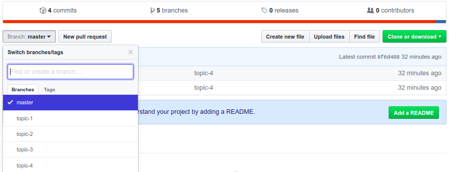

## 爬取微博内容(一)

### 本节内容

- 如何使用本教程
- 建立基本的文件结构
- 连接 Mysql
- 配置一些基本的信息

### 如何使用教程

这一小节是完成整个代码之后加上的，目的是简单说明一下如何使用本教程配合的代码，以及需要主要的一些事项。

[配套代码地址](https://github.com/zx576/tu-weibo/)

点击 branch 可以看到存在多个分支，topic-1分支代码对应 topic-1 教程文章



使用 `git clone` 克隆下代码后，使用 `git branch topic-1` 即可切换到 topic-1 分支，查看其中的代码。

另外，本教程没有模拟登录微博获取 cookie， 而是 F12 手动添加 cookie，所以 settings 文件下 cookie 需要定期更换。


### 可行性分析

微博内容向来难爬，本项目从　０　开始，教大家如何爬取某博主某月所有的博文。本项目选取了我比较感兴趣的　[爱可可－爱生活](http://weibo.com/fly51fly?is_all=1&stat_date=201709#feedtop) 作为爬取对象。

正式爬之前，在网上找到了如下文章供参考：

- [Python 爬虫如何机器登录新浪微博并抓取内容？](https://www.zhihu.com/question/29666539)
- [新浪微博爬虫分享（一天可抓取 1300 万条数据）](http://blog.csdn.net/bone_ace/article/details/50903178)
- [用Python写一个简单的微博爬虫](http://python.jobbole.com/84349/)

等等

说明微博也不是不能爬，好几个地方都提到了模拟登录或者使用　COOKIE ，　说明获取微博内容需要登录，在本项目中，先手动登录微博，然后 F12 取到　HEADERS 中的 COOKIE 值应用到脚本中。

### 文件框架

#### 基本配置

所有常用不变的参数都在　settings.py 中，比如数据库配置信息，USER-AGENTS 等信息。


#### 数据库

爬下来的数据存到 Mysql 中，这里采用了 [peewee](http://docs.peewee-orm.com/en/latest/) 作为存储中介,所有的数据模型代码存储于 models.py 文件中。

如下的代码简单的介绍了如何使用 peewee 建立一个简单的数据模型，然后连接到数据库。

models.py

```python

from peewee import *
from settings import *

db = MySQLDatabase(
                    database=NAME,
                    user=USER,
                    passwd=PASSWD,
                    host=HOST
                )


class Base(Model):
	"""docstring for ClassName"""
	class Meta:
		database = db


class Testitem(Base):

	# for test
	field1 = CharField(verbose_name='字段一')
	field2 = IntegerField(verbose_name='字段二')	


def _check():

	db.connect()
	if not Testitem.table_exists():
		Testitem.create_table()


_check()

```

#### 请求网页

请求网页的方法被单独分离到 req.py ，他的作用只有请求某网页，然后返回原始的响应数据。这么做的好处在于，一是使我们框架清晰，另外如果遇到请求错误，我们能很快定位错误，修改代码而不影响到其他代码。


#### 清洗并保存数据

清洗保存数据的代码置于 clean.py ，本部分内容接收 req.py 中的请求结果，进行网页分析，提取有效内容，最后经过 models.py 的数据模型保存到数据库中

#### 简单测试

测试代码放在 test.py 中，比如我们建立了数据库模型，在正式跑代码之前，先自己测测连接存入数据库是否成功。

代码如下：

test.py
```python

from models import Testitem

class TestDB:

	def test_testitem(self):
		# 测试新建
		Testitem.create(
			field1='s',
			field2=3
			)


if __name__ == '__main__':
	tdb = TestDB()
	tdb.test_testitem()
```

在之后的代码中，我们会频繁的使用测试功能。


#### 一些小工具

一些小工具存储在 utils.py 中，他的功能是提供一些测试辅助，或者其他辅助，比如写一个装饰器看看某函数的运行时间，写一个装饰器使某函数延迟几秒执行

查看运行时间的装饰器

utils.py
```python
from functools import wraps
import time 

# 测试运行时间的装饰器
def process_time(func):
	@wraps(func)
	def inner(*arge, **kw):

		print(time.ctime())
		return func(*arge, **kw)
		print(time.ctime())

	return inner

```

#### 启动项目

最后启动整个项目的文件为 work.py。


### 总结

本节我们建立了整个项目的文件框架，将功能分成一个一个的小块到单独的文件中。可能有许多小伙伴会问，这样的一个爬取项目用得着整这么复杂么？ 最开始我刚学爬虫的时候把所有的代码放在一个文件中，随着项目的进行，发现代码极其难维护，常常牵一发而动全身。随着做完一个个的项目，踩了一个又一个的坑，最终形成了这么一套方法。

第一节的代码部分实现了 与 Mysql 的连接，同时测试了该连接。在 utils 中完成了一个简单的装饰器。