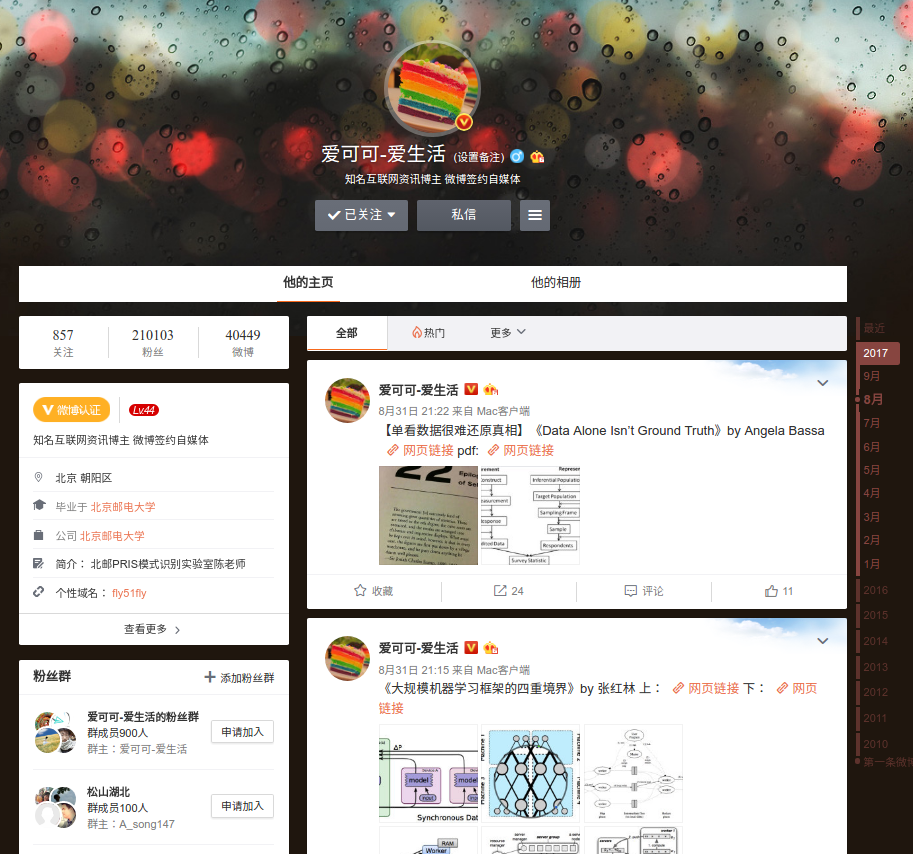
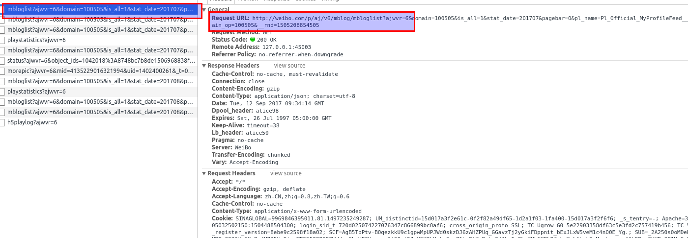

## 爬取微博内容(二)

### 本节内容

- 分析微博页面
- 尝试爬取内容

### 分析

在写爬虫代码之前，需要先对微博网页内容进行分析，查看其内容呈现形式，是否包含 ajax 加载。



一番折腾之后发现

```
http://weibo.com/fly51fly?is_all=1&stat_date=201709&page=2#feedtop

```

通过修改 stat_date 的值可以得到某年某月某页的第一显示页面，该页的剩下页面通过 ajax 加载

ajax 加载 url 示例 : `http://weibo.com/p/aj/v6/mblog/mbloglist?ajwvr=6&domain=100505&is_all=1&stat_date=201709&pagebar=0&pl_name=Pl_Official_MyProfileFeed__21&id=1005051402400261&script_uri=/fly51fly&feed_type=0&page=1&pre_page=1&domain_op=100505&__rnd=1505272050817`

其中 page 参数指定到具体的某一页，而 pagebar 参数指定 ajax 加载标记。



并发现如下规律：

1. 每一个单一页面使用 ajax 加载两次
2. 第二次 ajax 加载内容包含了该月所有的页面链接


比如说我们要获取 2017年9月所发的微薄所有内容，其逻辑应该为

1、 请求 
```
http://weibo.com/fly51fly?is_all=1&stat_date=201709&page=1#feedtop

```
获取第一页的正常加载内容

2、请求


```
http://weibo.com/p/aj/v6/mblog/mbloglist?ajwvr=6&domain=100505&is_all=1&stat_date=201709&pagebar=0&pl_name=Pl_Official_MyProfileFeed__21&id=1005051402400261&script_uri=/fly51fly&feed_type=0&page=1&pre_page=1&domain_op=100505&__rnd=1505272050817

```
通过修改 page 和 pagrbar 参数获取该页的 ajax 内容，并在第二次加载的 ajax 内容中获取该月一共有多少个页面，以供后续的请求下载。


### 代码


#### 构造一个请求网页的方法

创建一个请求网页的类，实现的目的如下：

- 对外提供一个接口函数，只需提供 url 即可。
- 请求网页
- 构造 header 和 proxy 进行请求
- 如果 请求失败则删除代理重新请求一次
- 请求 5 次失败，直接返回 None，并打印错误


req.py

```python

class Req:

	
	def _req_url(self, url, error=0):
		# ...

	def req_url(self, url):

		return self._req_url(url)

```

在提供的代码中使用了 \_\_new\_\_ 方法实现单例模式，去掉这一段代码也是可以的，感兴趣的同学可以参考 [单例模式](http://www.cnblogs.com/dyllove98/archive/2013/07/20/3202955.html)


#### 构造基本的网页分析框架

在之前的 分析 中，我们已经发现，所要爬取的内容分为正常加载和 ajax 加载，现在我们开始处理正常加载的内容

按照分析结果，类的结构如下

clean.py

```python


class Clean(object):

	# 初始化一些内容
	def __init__(self, date):
		# ...

	# 初始添加 urls
	def _init_ipt_queue(self):
		# ...

	# 普通的网页加载
	def _ana_normal_html(self, html):
		# ...

	# 分析网页并及时保存结果
	def _ana_html_tags(self, soup):
		# ...


	# ajax 加载的网页分析
	def _ana_ajax_html(self, html):
		# ...

	# 请求的过程中添加 url 到队列
	def add_pages_to_que(self, maxpage):
		# ...

	# 分发内容
	def _dispatch(self):
		# ...


```

最开始我们在 `__init__` 中初始化一些必须的内容，比如构建一个请求网页的实例方法，构建一个队列存储该月的url。

在教程中我们仅获取博主某一月的博文，所以构建类的时候传入一个 date 参数。

```python

# 初始化
def __init__(self, date):
	self.r = Req()
	self.que = queue.Queue()

	self.root_url = 'http://weibo.com/fly51fly?is_all=1&stat_date={0}&page={1}#feedtop'
	self.ajax_url = 'http://weibo.com/p/aj/v6/mblog/mbloglist?ajwvr=6&domain=100505& \
					is_all=1&stat_date={0}&pagebar={1}&pl_name=Pl_Official_MyProfileFeed__21& \
					id=1005051402400261&script_uri=/fly51fly&feed_type=0&page={2}&pre_page={2}& \
					domain_op=100505&__rnd=1505272050817'

	self.date = date
	# 初始添加 urls
	self._init_ipt_queue()

```

在初始化中构造了一个队列， 然后使用了 `_init_ipt_queue()` 方法向队列中添加了初始的 3 个 url.在爬取的过程中，我们还会向队列中添加其他 url.


然后构造了一个 `_dispatch` 函数，该函数的作用是读取队列中的 url，获取请求响应后的内容，按照要求分发给普通网页分析函数或者 ajax 加载网页函数。出现错误则打印错误结果。

```python

# 分发内容
def _dispatch(self):

	while True:
		if self.que.empty():
			break

		try:
			url = self.que.get()
			page = self.r.req_url(url)
			if url.startswith('http://weibo.com/p/aj'):
				self._ana_ajax_html(page.json())
			else:
				self._ana_normal_html(page.text)

		except Exception as e:
			print(e)
			break

```

#### 分析正常加载的函数

使用浏览器打开 `爱可可-爱生活` 博主的首页，使用 F12 查看网页源代码，发现博文内容并不属于正常的网页内容，而是以字符串的形式存在最后一个 script 标签中。

如下所示：

```html

<script>FM.view({"ns":"pl.content.homeFeed.index","domid":"Pl_Official_MyProfileFeed__21","css":["style/css/module/list/comb_WB_feed_profile.css?version=f37ddddda3de6d0d"],"js":"page/js/pl/content/homeFeed/index.js?version=5b30600ec8ea0c14","html":" <div class=\"WB_feed WB_feed_v3 WB_feed ... \/div>\r\n    "})</script>


```

处理的逻辑如下：

1. 首先使用 bs4/xpath 构造文档树，获取最后一个 script 标签内容
2. 使用字符串处理方法去除首尾的 `FM.view(...)` 无用字符
3. 将剩下的字符串使用 `json.loads` 转为字典，取出其中的 key 为 html 的内容
4. 再次将得到的字符串使用 bs4/xpath 构造新的文档树


代码如下
```python
# 普通的网页加载
	def _ana_normal_html(self, html):
		if not html:
			return
		# 最后一个 script 标签
		soup = bs4.BeautifulSoup(html, 'lxml')
		soup_script = soup.find_all('script')[-1]
		# 拿出 json 字符串并转换
		json_res = str(soup_script.string)[8:-1]
		new_html = json.loads(json_res)['html']
		# 重新渲染一遍
		new_soup = bs4.BeautifulSoup(new_html, 'lxml')

``` 

得到新的文档树之后，将其保存为 html 然后再进行分析，文件 new_soup.html 为我调试时保存的，可参看。
得到正常的含有内容的网页之后，就只剩下提取内容并保存到数据库了。这一步使用的是 `_ana_html_tags()` 函数，详情可参考代码。


### 小结

本节所含的内容较多，但又必不可少，大家可以分两次完成。一部分是为爬取做的铺垫，另一部分是爬取分析保存正常的网页内容。
在下一节中，我们将会分析 ajax 加载的网页内容。


