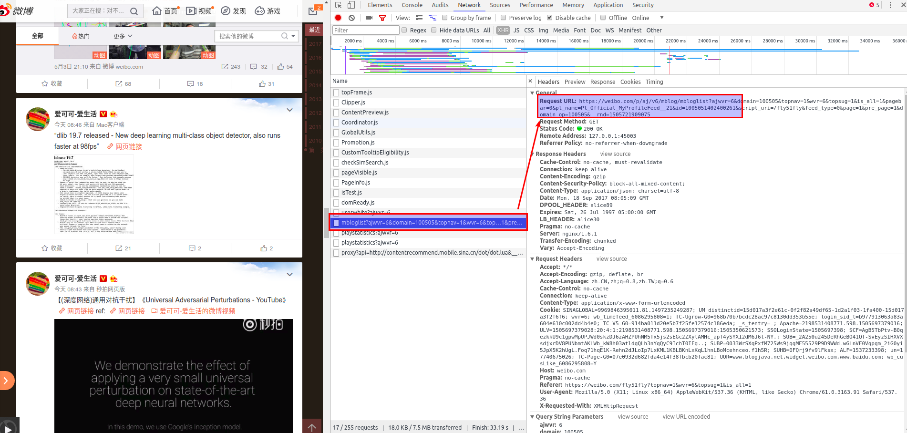
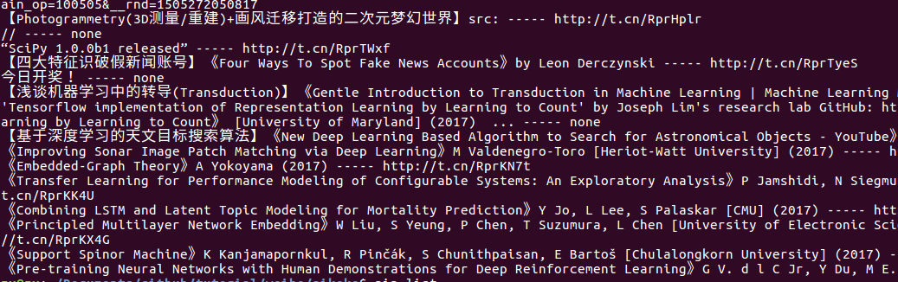
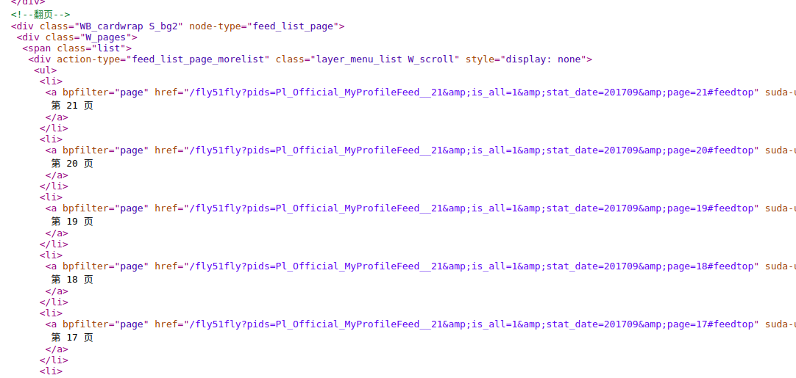

## 爬取微博内容(三)

在上节的内容中，我们分析了正常加载内容，本节的主要内容为分析 微博 ajax 加载内容。

### ajax 加载

我们打开博主 '爱可可-爱生活' 首页 `https://weibo.com/fly51fly?topnav=1&wvr=6&topsug=1&is_all=1`, 同时 F12 打开开发者工具，向下拉网页，等待新的内容加载，如下图所示。



分析之后发现，红框选中的链接为 ajax 加载链接，

```
https://weibo.com/p/aj/v6/mblog/mbloglist?ajwvr=6&domain=100505&is_all=1&stat_date={0}&pagebar={1}&pl_name=Pl_Official_MyProfileFeed__21&id=1005051402400261&script_uri=/fly51fly&feed_type=0&page={2}&pre_page={2}&domain_op=100505&__rnd=1505272050817

```

按照上一节的分析结果，其中 page 参数指定到具体的某一页，而 pagebar 参数指定 ajax 加载标记, stat\_date 为某年某月， pre\_page 与 page 的参数相同。

每一页有两次 ajax 加载,即 pagebar 分别为 0, 1。同时第二次 ajax 加载会给出所有本月的页数链接。

#### 代码

1、 打印输出 ajax 内容
clean.py

```python

# ajax 加载的网页分析
# html 为 ajax 响应的 json 数据
def _ana_ajax_html(self, html):

    # print(html)
    page = html['data']
    if not page: return 
    soup = bs4.BeautifulSoup(page, 'lxml')
    # 打印查看结果
    print(soup.prettify())
    # 调试时使用方法
    # 存入文本，使用 chrome 打开
    with open('ajax_soup.html', 'w')as f:
     	f.write(soup.prettify())

```

注： 如果请求不成功，可能需要更换 settings 中的 cookie.

运行之后，可以看到文件夹内生成了一个 ajax_soup.html 文件。使用浏览器打开即可进行分析。


2、 分析结果

在网页上查看之后，可以发现其 html 结构和正常加载的结构相同，这说明，我们可以直接使用 `_ana_html_tags()` 函数对结果进行分析。

```python
# ajax 加载的网页分析
def _ana_ajax_html(self, html):

    page = html['data']
    if not page: return 
    soup = bs4.BeautifulSoup(page, 'lxml')
    self._ana_html_tags(soup)

```

打印出的结果如下



分析部分就到此结束了，接下来我们要将 ajax 第二次加载内容中的所有本月其他页数链接提取出来，将其加入队列。

按照之前的思路，将加载内容保存为 html 文件，浏览器打开后发现如下内容：



可以发现，在 201709 这个月中，已经存在 21 页数据了，(题外： 写这篇文章的时候是 20170918 ,博主已经发了 21 页了，真是高产呀！)

我们只需要拿到 21 这个数据，然后在对 init 中的 url 进行拼接入队即可。

在 `_ana_html_tags` 函数之后添加以下内容

```python
# 获取本月总页数，然后入队 url
# self.signal 为是否添加执行入队标记
# 因为入队操作只需要执行一次
soup_pages = soup.find('div', class_='W_pages')
if soup_pages and self.signal:
    max_page_str = soup_pages.find('li').get_text()
    patt = re.compile(r'\d+')
    max_page = re.findall(patt, max_page_str)
    # 防止错误
    if not max_page: return
    max_page = int(max_page[0])
    # 打印看看
    print(max_page)
    self.add_pages_to_que(max_page)
    self.signal = False

```

`add_pages_to_que()`为添加 url 入队的函数，入队完成之后，将 signal 置于 False， 这样本月的所有 url 链接都取到了，在之后也不会重复入队。

3、 防止请求过快

为了防止请求过快被 weibo 屏蔽, 需要设置一些请求延时，在不修改现有的请求代码的前提下，我们在 utils 中实现一个装饰器来达到这个功能。

utils.py

```python
# 延迟执行 t 秒
def delay(t):
	if not isinstance(t, int):
		t = 3
	time.sleep(t)
	def wrapfunc(func):
		@wraps(func)
		def inner(*args, **kw):
			
			return func(*args, **kw)

		return inner

	return wrapfunc
```

这样只需要在所需延迟的函数添加装饰器即可

```python
@delay(3)
def f():
    print('hello, world')

```
这样表示延迟 3 秒执行 f　函数。
在正式的爬取过程中，将其添加在请求函数之前。

### 小结

本节内容主要讲述了对 weibo ajax 内容进行分析，将新的 url 进行入队操作，最后实现了一个延迟函数执行的装饰器。

参考资料：

- [python-lib-queue](https://docs.python.org/2/library/queue.html)
- [python队列Queue](http://www.cnblogs.com/itogo/p/5635629.html)

- [A guide to Python's function decorators](http://thecodeship.com/patterns/guide-to-python-function-decorators/)
- [廖雪峰-装饰器](http://www.liaoxuefeng.com/wiki/0014316089557264a6b348958f449949df42a6d3a2e542c000)
- [12步轻松搞定python装饰器](http://python.jobbole.com/81683/)

