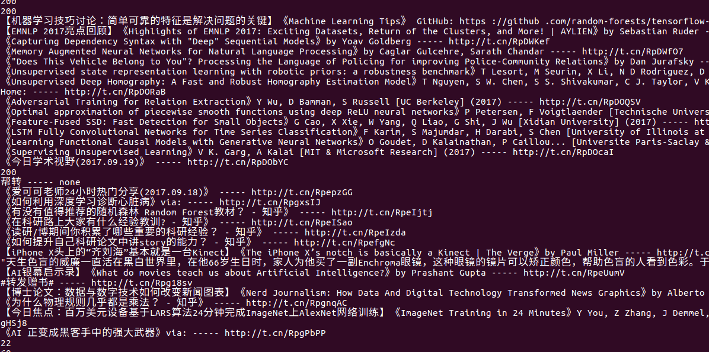
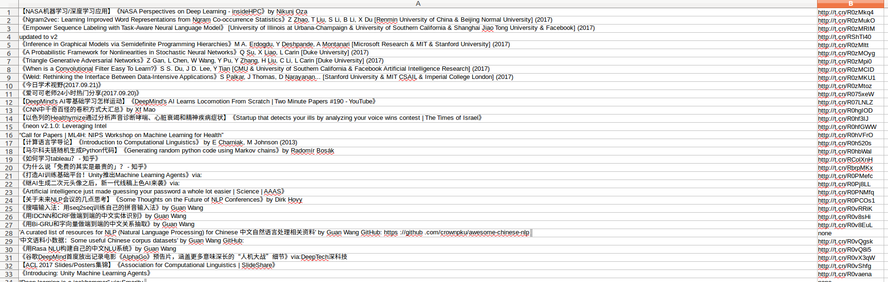

## 爬取微博内容(四)

在前一节内容中，我们处理了，ajax加载内容的分析，看起来已经已经快要大功告成了，在本节，我们会做一些细节处理

- 存储
- 对外提供启动接口

### 防止请求过快

上一节内容的最后，我们生成了一个延时执行装饰器,本节将其加在请求方法上,设置延迟一秒，

req.py

```python

@delay(1)
def req_url(self, url):
    return self._req_url(url)

```

### 存储

在之前的章节中，由于是调试过程，直接将最后的内容打印输出，而没有存入到数据库中，拉出上一节的代码，更改 settings　中的 cookie，运行 test.py ，看看打印结果



结果没什么问题，其中可能会有一些 '转发/帮转'　等无效信息，占比非常低，教程中就不做处理了，有兴趣的小伙伴可以做进一步处理

修改 clean.py, 建立存储部分代码

```python
# 保存数据函数
def _save_data(self, content, url):
    # 查看是否已经存在
    # 防止内容过长
    content = content[:254]
    Aikeke.get_or_create(
        content=content,
        url=url)

```

### 正式爬取

#### 打印并保存 url

在爬取的过程中，增加一些打印输出，这样以便于掌握爬取的进度，主要打印了以下内容：

- 请求成功的 url
- 请求失败，重新入队的 url
- 程序异常信息
- 获取到总页数之后，打印当前队列元素

等信息

代码分散在各个函数中，就不在此演示了


#### 完善 clean.py

在之前的代码中，应该可以发现，我在Clean这个类下面写的函数都是以 `_` 单下划线开头的，这是 python 中约定俗成的一种写法，单下滑线开头的函数原则上不对外提供，仅在类内使用。

所以还需要一个接口，提供给外界使用,非常简单的两句。

```python

def work(self):
    return self._dispatch()
    
```

#### 完善 work.py

在最开始的设计中， work.py 这个文件的定位为整个项目的入口，现在代码主体部分完成了，现在完成这个入口。

```
from clean import Clean

def main():

	c = Clean('201709')
	c.work()

if __name__ == '__main__':
	main()

```

### 正式爬取

命令行下：

```
$ python work.py
```

我分别测试了 '201709'，'201708', '201707'， 三个参数，都正常的爬取了所有的信息，如果要爬取一整年的信息，修改代码为多线程或者循环的模式即可，不过这里需要配合大量的代理和许多可用的帐号，一个帐号爬取太容易被封号了。

爬取结果：


查看数据库信息：


一共 2532 条信息


### 输出为文本

在数据库内，数据不是很客观，将其输出为 csv 文件，这样看起来会直观一些

tofile.py

代码结构如下，推荐有心的同学可以自己先实现一下。
```python

class ToCsv:

	def __init__(self):
		pass

    # 插入一行
	def _insertrow(self, lst):
        pass

    # 逐行提取数据
    # 逐行插入
	def _extract(self):
        pass

    # 对外启动接口
	def work(self):
		return self._extract()


if __name__ == '__main__':
	tc = ToCsv()
	tc.work()


```

生成的文件如下：




### 总结

到此，整个项目就结束了，感谢所有能看到这里的同学。


